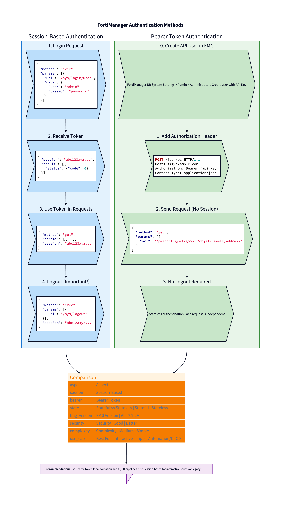

# 🔐 Authentication Scripts

> **Authenticate with FortiManager API using session tokens or API keys.**

[Home](../../../README.md) > [Level 1](../../README.md) > [Bash](../README.md) > Authentication

---

## 📋 Overview

FortiManager supports two authentication methods: **Session-based** (all versions) and **Bearer Token/API Key** (FMG 7.2.2+).

For a complete understanding of authentication concepts, security best practices, and detailed workflows, see the **[Authentication Guide](../../../docs/02-authentication.md)**.



---

## 📜 Scripts

| Script | Method | Description |
|--------|--------|-------------|
| `login-session.sh` | **Session** | Login with username/password, returns session token |
| `login-bearer.sh` | **Bearer** | Test API key connection |
| `logout.sh` | **Session** | Close and invalidate session |

---

## 🚀 Quick Start

### Bearer Token *(Recommended for automation)*

```bash
# 1. Set API key in .env
FMG_API_KEY=your_api_key_here

# 2. Test connection
./login-bearer.sh

# 3. Use scripts directly - no login/logout needed
../02-addresses/read-addresses.sh
```

### Session-Based

```bash
# 1. Login and capture session token
SESSION=$(./login-session.sh)

# 2. Use session in subsequent calls
../02-addresses/read-addresses.sh -S "$SESSION"

# 3. Always logout when done
./logout.sh "$SESSION"
```

---

## 💡 Examples

### Test Connection with API Key

```bash
./login-bearer.sh

# Expected output:
# ✓ Connected to 192.168.1.100
# ✓ FortiManager: FMG-01
# ✓ Version: 7.4.10
```

### Session Workflow with Error Handling

```bash
#!/bin/bash
SESSION=""
trap './logout.sh "$SESSION" 2>/dev/null' EXIT

SESSION=$(./login-session.sh)
if [ -z "$SESSION" ]; then
    echo "Login failed"
    exit 1
fi

# Your operations here
../02-addresses/read-addresses.sh -S "$SESSION"
```

---

## ⚙️ Options Reference

### login-session.sh

| Option | Description |
|--------|-------------|
| `-h` | Show help |
| `-v` | Verbose output |

### logout.sh

| Option | Description |
|--------|-------------|
| `$1` | **Required**: Session token to invalidate |

---

## 🔗 See Also

- [PowerShell Equivalent](../../powershell/01-auth/)
- [Next: Addresses](../02-addresses/)
- [Authentication Guide](../../../docs/02-authentication.md) *(Complete reference)*
- [Common Errors](../../../cheatsheets/common-errors.md)
