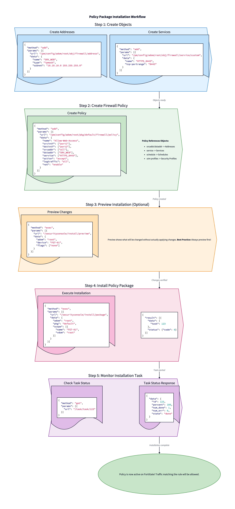

# 🔥 Firewall Policy Scripts

> **CRUD operations for firewall policies and policy package installation.**

[Home](../../../README.md) > [Level 1](../../README.md) > [Bash](../README.md) > Firewall Policies

---

## 📋 Overview

Firewall policies are the core of FortiGate security - they control what traffic is allowed, denied, or inspected. This section covers policy CRUD operations and deployment to FortiGates.



---

## 🔗 API Endpoints

| Type | Endpoint |
|------|----------|
| **Firewall Policy** | `/pm/config/adom/{adom}/pkg/{pkg}/firewall/policy` |
| **Install Package** | `/securityconsole/install/package` |
| **Install Preview** | `/securityconsole/install/preview` |

---

## 📜 Scripts

| Script | Description |
|--------|-------------|
| `crud-policies.sh` | **Full CRUD** + move for firewall policies |
| `install-package.sh` | **Install** policy package to devices |

---

## 🔧 Policy Actions

| Action | Description |
|--------|-------------|
| **accept** | *Allow traffic* |
| **deny** | *Block traffic (silent)* |
| **reject** | *Block with ICMP response* |

---

## 💡 Examples

### Create Policy

```bash
# Allow web traffic
./crud-policies.sh -a create -n "Allow-Web-Traffic" \
    --srcintf "port1" \
    --dstintf "port2" \
    --srcaddr "all" \
    --dstaddr "NET_SERVERS" \
    --service "HTTP,HTTPS" \
    --policy-action accept \
    --nat enable \
    -c "Allow web to servers"

# Block social media
./crud-policies.sh -a create -n "Block-Social" \
    --srcintf "port1" \
    --dstintf "port3" \
    --srcaddr "NET_USERS" \
    --dstaddr "all" \
    --service "ALL" \
    --policy-action deny \
    -c "Block social media"
```

### Read Policies

```bash
# List all policies
./crud-policies.sh -a read

# Get specific policy by ID
./crud-policies.sh -a read -i 5

# JSON output
./crud-policies.sh -a read -j
```

### Update Policy

```bash
# Update comment
./crud-policies.sh -a update -i 5 -c "Updated policy comment"

# Change action
./crud-policies.sh -a update -i 5 --policy-action deny
```

### Move Policy

```bash
# Move policy 5 before policy 2
./crud-policies.sh -a move -i 5 --move-target 2 --move-option before

# Move policy 3 after policy 10
./crud-policies.sh -a move -i 3 --move-target 10 --move-option after
```

### Delete Policy

```bash
./crud-policies.sh -a delete -i 5
```

---

## 📦 Policy Installation

### Preview Changes

```bash
# Preview before installing (recommended)
./install-package.sh -d FGT-01 --preview
```

### Install Package

```bash
# Install to single device
./install-package.sh -d FGT-01 -p default -v root

# Install to multiple devices
./install-package.sh -d "FGT-01,FGT-02" -p default
```

### Check Task Status

```bash
# Installation returns task ID - monitor with:
./install-package.sh -d FGT-01 -p default --wait
```

---

## ⚙️ Options Reference

### crud-policies.sh

| Option | Description | Required |
|--------|-------------|----------|
| `-a` | **Action**: `create`, `read`, `update`, `delete`, `move` | *Yes* |
| `-i` | Policy **ID** | *Yes* (update/delete/move) |
| `-n` | Policy **name** | *Yes* (create) |
| `--srcintf` | **Source** interface | *Yes* (create) |
| `--dstintf` | **Destination** interface | *Yes* (create) |
| `--srcaddr` | **Source** address | *Yes* (create) |
| `--dstaddr` | **Destination** address | *Yes* (create) |
| `--service` | **Services** (comma-separated) | *Yes* (create) |
| `--policy-action` | **Action**: accept, deny, reject | *Yes* (create) |
| `--nat` | **NAT**: enable, disable | *No* |
| `--move-target` | Target policy **ID** for move | *Yes* (move) |
| `--move-option` | **Position**: before, after | *Yes* (move) |
| `-c` | **Comment** | *No* |
| `-j` | JSON output | *No* |

### install-package.sh

| Option | Description | Required |
|--------|-------------|----------|
| `-d` | **Device** name(s) | *Yes* |
| `-p` | **Package** name | *No* (default: default) |
| `-v` | **VDOM** name | *No* (default: root) |
| `--preview` | Preview only (*dry-run*) | *No* |
| `--wait` | Wait for completion | *No* |

---

## ✅ Best Practices

| Practice | Reason |
|----------|--------|
| **Always preview first** | *Avoid unexpected changes* |
| **Use descriptive names** | *Easier troubleshooting* |
| **Comment all policies** | *Document purpose* |
| **Order matters** | *First match wins* |

---

## 🔗 See Also

- [PowerShell Equivalent](../../powershell/07-firewall-policies/)
- [Previous: Security Profiles](../06-security-profiles/)
- [API Endpoints Cheatsheet](../../../cheatsheets/api-endpoints.md)
- [Common Errors](../../../cheatsheets/common-errors.md)
- [Policy Installation Diagram](../../../diagrams/05-policy-installation-workflow.png)
