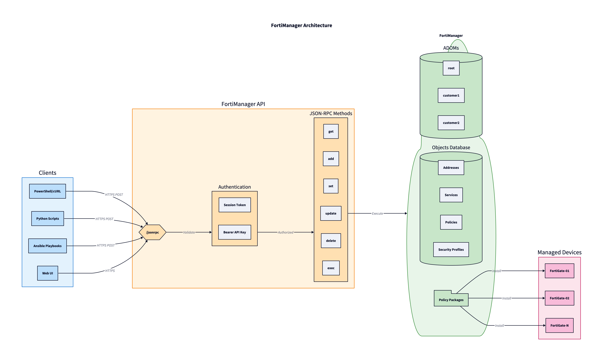
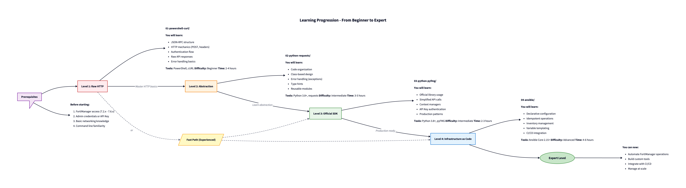
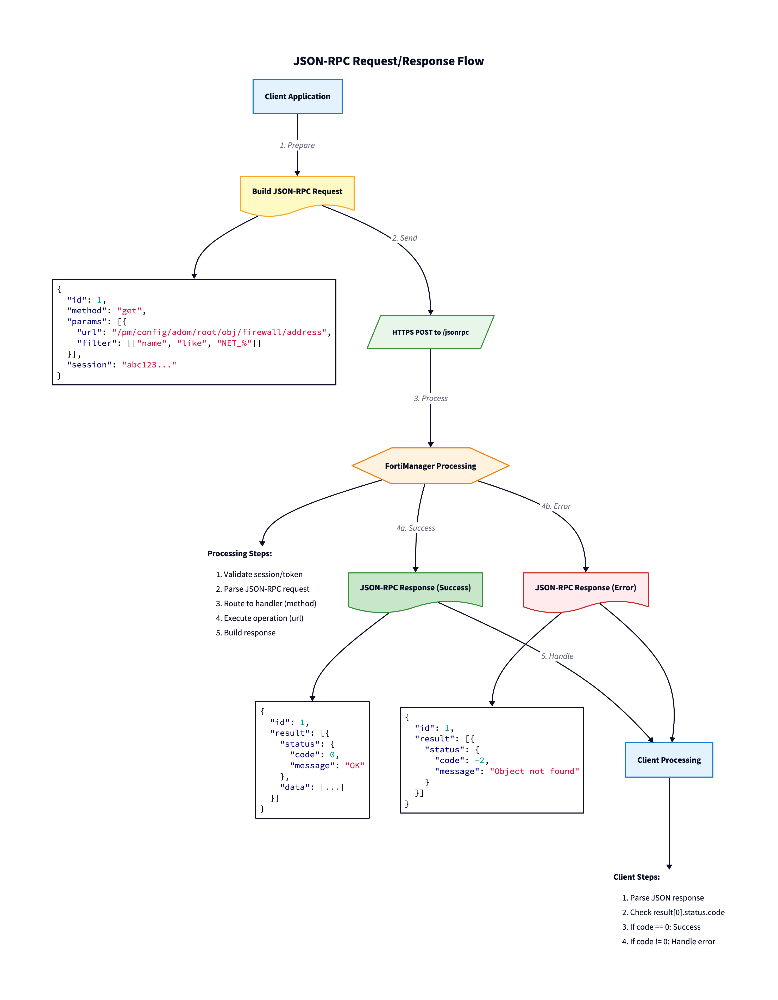

# FortiManager API Automation Demo

> **A comprehensive educational repository for learning FortiManager JSON-RPC API automation through 4 progressive approaches.**


---

## Table of Contents

- [Overview](#overview)
- [Architecture](#architecture)
- [Prerequisites](#prerequisites)
- [Quick Start](#quick-start)
- [Learning Path](#learning-path)
- [Project Structure](#project-structure)
- [API Concepts](#api-concepts)
- [Covered Operations](#covered-operations)
- [Best Practices](#best-practices)
- [Troubleshooting](#troubleshooting)
- [References](#references)

---

## Overview

This repository provides a hands-on learning experience for automating FortiManager operations using its JSON-RPC API. Whether you're a network engineer looking to automate routine tasks or a DevOps professional integrating network security into CI/CD pipelines, this project will guide you from basic HTTP calls to production-ready automation.

### What You'll Learn

- **JSON-RPC API fundamentals** - Understand how FortiManager's API differs from REST
- **Authentication methods** - Master session-based and Bearer token authentication
- **CRUD operations** - Create, Read, Update, Delete firewall objects
- **Policy management** - Automate firewall policies and installations
- **Best practices** - Write production-ready automation code

---

## Architecture



FortiManager serves as a centralized management platform for FortiGate devices. The JSON-RPC API allows you to:

1. **Manage Objects** - Addresses, services, schedules, NAT configurations
2. **Configure Policies** - Firewall rules, security profiles
3. **Deploy Changes** - Install policy packages to FortiGates
4. **Monitor Status** - Track tasks, devices, and installations

---

## Prerequisites

### FortiManager Requirements

| Requirement | Version |
|-------------|---------|
| **FortiManager** | *7.2.x - 7.6.x* |
| **API Access** | *Admin with API permissions or API Key* |
| **Network** | *HTTPS access (port 443)* |

### Local Environment

| Tool | Version | Required For |
|------|---------|--------------|
| **Bash** | *4.0+* | Section 01 (Linux/macOS) |
| **PowerShell** | *7.0+* | Section 01 (Windows) |
| **curl** | *7.0+* | Section 01 |
| **jq** | *1.6+* | Section 01 (JSON parsing) |
| **Python** | *3.8+* | Sections 02-03 |
| **Ansible** | *2.15+* | Section 04 |
| **pip** | *Latest* | Python dependencies |

### Python Dependencies

```bash
# For section 02
pip install requests python-dotenv

# For section 03
pip install pyfmg python-dotenv

# For section 04
pip install ansible
ansible-galaxy collection install fortinet.fortimanager
```

---

## Quick Start

### 1. Clone the Repository

```bash
git clone https://github.com/your-username/Demo-FortiManager.git
cd Demo-FortiManager
```

### 2. Configure Environment

```bash
# Copy the example environment file
cp .env.example .env

# Edit with your FortiManager credentials
nano .env  # or use your preferred editor
```

**Required variables in `.env`:**

```bash
# FortiManager connection
FMG_HOST=192.168.1.100
FMG_PORT=443

# Authentication (choose one method)
# Method 1: Session-based
FMG_USERNAME=api_admin
FMG_PASSWORD=your_secure_password

# Method 2: API Key (recommended for FMG 7.2.2+)
# FMG_API_KEY=your_api_key_here

# Configuration
FMG_ADOM=root
FMG_VERIFY_SSL=false
FMG_DEBUG=false
```

### 3. Test Connection

**PowerShell:**
```powershell
cd 01-powershell-curl/01-auth
.\login-session.ps1
```

**Python:**
```bash
cd 02-python-requests/01_auth
python demo_auth.py
```

---

## Learning Path

This repository is organized as a progressive learning path. Each level builds on the previous one:



### Level 1: Raw HTTP (PowerShell/cURL)

**Folder:** `01-powershell-curl/` (Windows) | `01-bash-curl/` (Linux)

Start here to understand the fundamentals:
- HTTP POST mechanics
- JSON-RPC request/response structure
- Session-based authentication flow
- Raw error handling

**Best for:** Understanding "what happens under the hood"

| Platform | Folder | Requirements |
|----------|--------|--------------|
| **Windows** | `01-powershell-curl/` | *PowerShell 7.0+* |
| **Linux/macOS** | `01-bash-curl/` | *bash 4.0+, curl, jq* |

### Level 2: Abstraction (Python + requests)

**Folder:** `02-python-requests/`

Learn to build reusable code:
- Class-based design patterns
- Custom exception handling
- Type hints and documentation
- Modular architecture

**Best for:** Building custom tools and integrations

### Level 3: Official SDK (pyFMG)

**Folder:** `03-python-pyfmg/`

Use Fortinet's official library:
- Simplified API calls
- Context managers for session handling
- Production-ready patterns
- API Key authentication

**Best for:** Production scripts and applications

### Level 4: Infrastructure as Code (Ansible)

**Folder:** `04-ansible/`

Declarative configuration management:
- Idempotent operations
- Inventory and variable management
- Playbook composition
- CI/CD integration

**Best for:** Team collaboration and GitOps workflows

---

## Project Structure

```
Demo-FortiManager/
│
├── 📄 .env.example                 # Environment template
├── 📄 .gitignore                   # Git ignore rules
├── 📄 README.md                    # This file
│
├── 📁 01-powershell-curl/          # 🪟 Level 1: Raw HTTP (Windows)
│   ├── 📁 config/                  # ⚙️ Configuration loading
│   ├── 📁 utils/                   # 🔧 Helper functions
│   ├── 📁 01-auth/                 # 🔐 Authentication examples
│   ├── 📁 02-addresses/            # 🏠 Address CRUD
│   ├── 📁 03-services/             # 🔌 Service CRUD
│   ├── 📁 04-schedules/            # 📅 Schedule CRUD
│   ├── 📁 05-nat-vip/              # 🔀 NAT/VIP CRUD
│   ├── 📁 06-security-profiles/    # 🛡️ Security profile CRUD
│   └── 📁 07-firewall-policies/    # 🔥 Policy CRUD + install
│
├── 📁 01-bash-curl/                # 🐧 Level 1: Raw HTTP (Linux/macOS)
│   ├── 📁 config/                  # ⚙️ Configuration loading
│   ├── 📁 utils/                   # 🔧 Helper functions
│   └── 📁 01-07_*/                 # Same structure as PowerShell
│
├── 📁 02-python-requests/          # 🐍 Level 2: Python abstraction
│   ├── 📁 config/                  # ⚙️ Settings management
│   ├── 📁 utils/                   # 🔧 FMG client and exceptions
│   └── 📁 01-07_*/                 # Feature demonstrations
│
├── 📁 03-python-pyfmg/             # 📦 Level 3: Official SDK
│   ├── 📁 01_auth/                 # 🔐 Authentication demos
│   ├── 📁 02_addresses/            # 🏠 Address operations
│   └── 📁 07_firewall_policies/    # 🔥 Complete workflow
│
├── 📁 04-ansible/                  # 🅰️ Level 4: Infrastructure as Code
│   ├── 📁 inventory/               # 📋 Host definitions
│   ├── 📁 playbooks/               # 📜 Automation playbooks
│   ├── 📁 vars/                    # 📝 Variable files
│   └── 📄 requirements.yml         # Collection dependencies
│
├── 📁 docs/                        # 📚 Documentation
│   ├── 📄 00-introduction.md       # FortiManager overview
│   ├── 📄 01-concepts-json-rpc.md  # JSON-RPC deep dive
│   └── 📄 02-authentication.md     # Auth methods explained
│
├── 📁 cheatsheets/                 # 📋 Quick reference guides
│   ├── 📄 api-endpoints.md         # Endpoint reference
│   ├── 📄 common-errors.md         # Error code guide
│   └── 📄 curl-examples.md         # cURL examples
│
└── 📁 diagrams/                    # 🖼️ Visual documentation
    ├── 📄 *.d2                     # D2 source files
    └── 🖼️ *.png                    # Generated images
```

---

## API Concepts

### JSON-RPC vs REST

FortiManager uses **JSON-RPC**, not REST. Key differences:

| Aspect | REST | JSON-RPC (FortiManager) |
|--------|------|-------------------------|
| **Endpoints** | *Multiple* (`/users`, `/posts`) | *Single* (`/jsonrpc`) |
| **HTTP Method** | *GET, POST, PUT, DELETE* | *Always POST* |
| **Routing** | *URL path* | *`method` field in body* |
| **Resource** | *In URL* | *`url` field in params* |

### Request Structure



```json
{
    "id": 1,
    "method": "get",
    "params": [
        {
            "url": "/pm/config/adom/root/obj/firewall/address",
            "filter": [["name", "like", "NET_%"]],
            "fields": ["name", "subnet"]
        }
    ],
    "session": "your-session-token"
}
```

### Authentication Methods


**Session-based (All FMG versions):**
1. POST to `/sys/login/user` with credentials
2. Receive session token
3. Include token in all subsequent requests
4. POST to `/sys/logout` when done

**Bearer Token (FMG 7.2.2+):**
1. Create API user in FMG UI
2. Add `Authorization: Bearer <key>` header
3. No login/logout required

### CRUD Methods


| Method | Purpose | REST Equivalent |
|--------|---------|-----------------|
| **`get`** | *Read objects* | GET |
| **`add`** | *Create new* | POST |
| **`set`** | *Create or replace* | PUT |
| **`update`** | *Partial update* | PATCH |
| **`delete`** | *Remove* | DELETE |
| **`exec`** | *Execute actions* | POST (action) |

---

## Covered Operations

Each section demonstrates CRUD operations on:

### Firewall Objects

| Object Type | Operations | API Path |
|-------------|------------|----------|
| **IPv4 Addresses** | *CRUD* | `/pm/config/adom/{adom}/obj/firewall/address` |
| **IPv6 Addresses** | *CRUD* | `/pm/config/adom/{adom}/obj/firewall/address6` |
| **Address Groups** | *CRUD* | `/pm/config/adom/{adom}/obj/firewall/addrgrp` |
| **Services** | *CRUD* | `/pm/config/adom/{adom}/obj/firewall/service/custom` |
| **Service Groups** | *CRUD* | `/pm/config/adom/{adom}/obj/firewall/service/group` |
| **Schedules** | *CRUD* | `/pm/config/adom/{adom}/obj/firewall/schedule/onetime` |

### NAT Configuration

| Object Type | Operations | API Path |
|-------------|------------|----------|
| **Virtual IPs** | *CRUD* | `/pm/config/adom/{adom}/obj/firewall/vip` |
| **IP Pools** | *CRUD* | `/pm/config/adom/{adom}/obj/firewall/ippool` |

### Security Policies

| Object Type | Operations | API Path |
|-------------|------------|----------|
| **Firewall Policies** | *CRUD* | `/pm/config/adom/{adom}/pkg/{pkg}/firewall/policy` |
| **Policy Installation** | *Execute* | `/securityconsole/install/package` |

---

## Best Practices

### Security

1. **Never commit credentials** - Use `.env` files and add to `.gitignore`
2. **Use API Keys** - More secure than session-based for automation
3. **Validate SSL** - Enable `FMG_VERIFY_SSL=true` in production
4. **Least privilege** - Create API users with minimal required permissions

### Code Quality

1. **Error handling** - Always check `status.code` in responses
2. **Idempotency** - Use `set` for create-or-update patterns
3. **Logging** - Enable `FMG_DEBUG=true` during development
4. **Documentation** - Comment complex operations

### Operations

1. **Preview before install** - Use `/securityconsole/install/preview`
2. **Test in lab** - Validate automation before production
3. **Backup configs** - Before bulk operations
4. **Monitor tasks** - Check task status for long-running operations

---

## Troubleshooting

### Common Error Codes


| Code | Meaning | Solution |
|------|---------|----------|
| **0** | *Success* | - |
| **-2** | *Object not found* | Check name/path/ADOM |
| **-3** | *Object exists* | Use `set` or `update` |
| **-6** | *Permission denied* | Check user permissions |
| **-10** | *Object in use* | Remove references first |
| **-11** | *Invalid session* | Re-authenticate |
| **-20** | *Invalid URL/Syntax* | Check endpoint path |
| **-10147** | *No write permission* | Lock ADOM (workspace mode) |

### Debug Mode

Enable debug output to see raw requests/responses:

```bash
# In .env
FMG_DEBUG=true
```

### Common Issues

**Connection refused:**
- Verify `FMG_HOST` and `FMG_PORT`
- Check firewall rules
- Confirm HTTPS is enabled

**Authentication failed:**
- Verify credentials in `.env`
- Check user has API access
- For API Key: verify key is active

**Object not found:**
- Confirm ADOM is correct
- Check object name spelling
- Verify URL path

---

## References

### Official Documentation

- [FortiManager Administration Guide](https://docs.fortinet.com/document/fortimanager/7.6.0/administration-guide)
- [FortiManager API Best Practices](https://docs.fortinet.com/document/fortimanager/7.6.0/api-best-practices/500458/introduction)
- [How to FortiManager API (ReadTheDocs)](https://how-to-fortimanager-api.readthedocs.io/)

### Libraries & Tools

- [pyFMG on PyPI](https://pypi.org/project/pyfmg/) - Official Python library
- [pyFMG on GitHub](https://github.com/p4r4n0y1ng/pyfmg) - Source code
- [fortinet.fortimanager Ansible Collection](https://docs.ansible.com/ansible/latest/collections/fortinet/fortimanager/index.html)

### Community

- [Fortinet Community - API Tips](https://community.fortinet.com/t5/FortiManager/Technical-Tip-Using-FortiManager-FortiAnalyzer-API/ta-p/221089)
- [Fortinet Developer Network](https://fndn.fortinet.net/)

---

## License

This project is licensed under the MIT License - see the [LICENSE](LICENSE) file for details.


